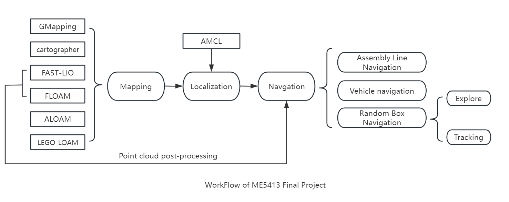
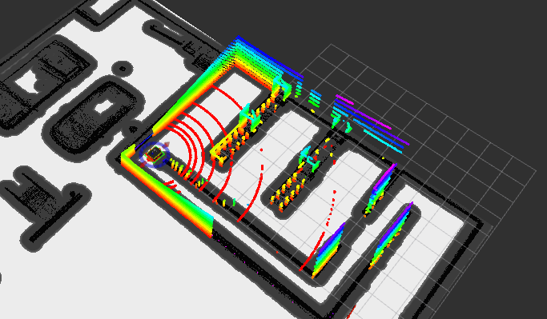
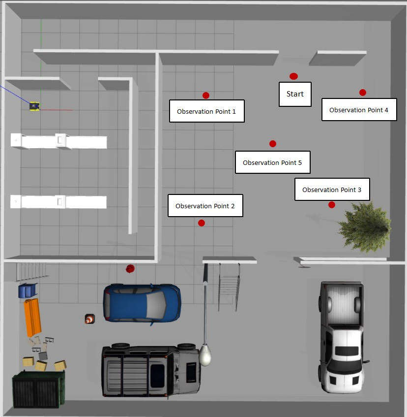
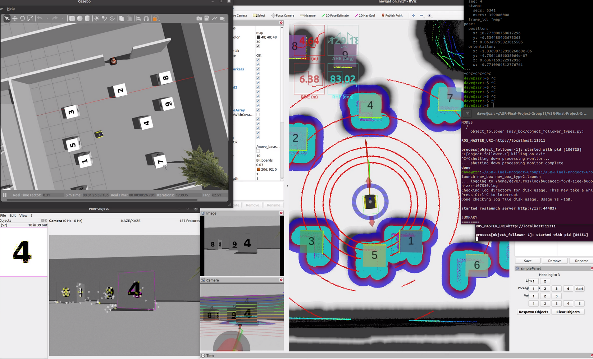

# ME5413_Final_Project

NUS ME5413 Autonomous Mobile Robotics Final Project
> origin Authors: [Christina](https://github.com/ldaowen), [Yuhang](https://github.com/yuhang1008), [Dongen](https://github.com/nuslde), and [Shuo](https://github.com/SS47816)

> Project group 11：[Ma RuiQi](https://github.com/RachelFengRobotics)，[ChenHan](https://github.com/Hans1011)，[Bai ChengXi](https://github.com/roudanshuangfi)，[LiuFu YuLiang](https://github.com/YuliangLF)，[Zhong ZeRen](https://github.com/HardyPavel)，[Zhang ZiRui](https://github.com/daverui)


## Dependencies

* System Requirements:
  * Ubuntu 20.04 (18.04 not yet tested)
  * ROS Noetic (Melodic not yet tested)
  * C++11 and above
  * CMake: 3.0.2 and above
* This repo depends on the following standard ROS pkgs:
  * `roscpp`
  * `rospy`
  * `rviz`
  * `std_msgs`
  * `nav_msgs`
  * `geometry_msgs`
  * `visualization_msgs`
  * `tf2`
  * `tf2_ros`
  * `tf2_geometry_msgs`
  * `pluginlib`
  * `map_server`
  * `gazebo_ros`
  * `jsk_rviz_plugins`
  * `jackal_gazebo`
  * `jackal_navigation`
  * `velodyne_simulator`
  * `teleop_twist_keyboard`
  * `teb planner`->sudo apt-get install ros-noetic-teb-local-planner
  * `rviz-plugin`->sudo apt-get install ros-noetic-rviz-imu-plugin
  * `find_object_2d`->sudo apt-get install ros-noetic-find-object-2d
  * And this [gazebo_model](https://github.com/osrf/gazebo_models) repositiory

## Installation

This repo is a ros workspace, containing three rospkgs:

* `interactive_tools` are customized tools to interact with gazebo and your robot
* `jackal_description` contains the modified jackal robot model descriptions
* `me5413_world` the main pkg containing the gazebo world, and the launch files

**Note:** If you are working on this project, it is encouraged to fork this repository and work on your own fork!

After forking this repo to your own github:

```bash
# Clone your own fork of this repo (assuming home here `~/`)
cd
git clone https://github.com/<YOUR_GITHUB_USERNAME>/ME5413_Final_Project.git
cd ME5413_Final_Project

# Install all dependencies
rosdep install --from-paths src --ignore-src -r -y

# Build
catkin_make
# Source 
source devel/setup.bash
```

To properly load the gazebo world, you will need to have the necessary model files in the `~/.gazebo/models/` directory.

There are two sources of models needed:

* [Gazebo official models](https://github.com/osrf/gazebo_models)
  
  ```bash
  # Create the destination directory
  cd
  mkdir -p .gazebo/models

  # Clone the official gazebo models repo (assuming home here `~/`)
  git clone https://github.com/osrf/gazebo_models.git

  # Copy the models into the `~/.gazebo/models` directory
  cp -r ~/gazebo_models/* ~/.gazebo/models
  ```

* [Our customized models](https://github.com/NUS-Advanced-Robotics-Centre/ME5413_Final_Project/tree/main/src/me5413_world/models)

  ```bash
  # Copy the customized models into the `~/.gazebo/models` directory
  cp -r ~/ME5413_Final_Project/src/me5413_world/models/* ~/.gazebo/models
  ```

## Project Introduction

In this project, we used a Jackal car to achieve the basic functions of mapping and navigation in a mini factory. At the same time, we initially implemented the functions of exploration, target recognition, and tracking in the randomly generated box area of the factory. Specifically, our main work is as follows:

I. Mapping

(1) Using 2D LiDAR algorithm to construct a map of the mini factory, the algorithms used in this project include:`Cartographer`,`GMapping`.

(2) Using 3D LiDAR algorithm to build a map of the mini factory, the algorithms used in this project include:`ALOAM`,`FLOAM`,`LEGO-LOAM`,`FAST-LIO`.

(3) Compare the performance of various mapping algorithms to generate the final`. pgm` map for navigation planning.

II. Navigation

(1) We used `AMCL` method to enable robots to achieve self localization，after that we use `A*` as the global planning algorithm on the constructed map and tested the performance of `DWA` and `TEB` as local planners respectively.

(2) A navigation algorithm for randomly generated boxes was designed, and visual functionality was introduced using the `find_object_2D` ros package to achieve automatic exploration, target recognition, and navigation of the car in the target area.



# Part I Mapping

This command will launch the gazebo with the project world

```bash
# Launch Gazebo World together with our robot
roslaunch me5413_world world.launch
```
If you wish to explore the gazebo world a bit, we provide you a way to manually control the robot around:

```bash
# Only launch the robot keyboard teleop control
roslaunch me5413_world manual.launch
```

**Note:** This robot keyboard teleop control is also included in all other launch files, so you don't need to launch this when you do mapping or navigation.


If you want to execute more mapping algorithms, you can use our pre recorded Ros bag and execute the following command in the directory of the mapping algorithm file we provide（Take FAST-LIO as example）:

```bash
# Launch the mapping algorithms
roslaunch mapping_velodyne.launch
# Play our pre-recorded rosbag
rosbag play .bag
```

### 2. Mapping

After launching **Step 0**, in the second terminal:

```bash
# Launch GMapping
roslaunch me5413_world mapping.launch
```

After finishing mapping, run the following command in the thrid terminal to save the map:

```bash
# Save the map as `my_map` in the `maps/` folder
roscd me5413_world/maps/
rosrun map_server map_saver -f my_map map:=/map
```


### 3. Navigation

Once completed **Step 2** mapping and saved your map, quit the mapping process.

Then, in the second terminal:

```bash
# Load a map and launch AMCL localizer
roslaunch me5413_world navigation.launch
# Load the template in “objects” folder
```


```bash
# Choose the five observation points base on your target box location
Click the button on Rviz Panel
```


```bash
# Use our vison algorithm to navigate towards the target box
roslaunch nav_box nav_box_type2.launch
```


## Contribution

You are welcome contributing to this repo by opening a pull-request

We are following:

* [Google C++ Style Guide](https://google.github.io/styleguide/cppguide.html),
* [C++ Core Guidelines](https://isocpp.github.io/CppCoreGuidelines/CppCoreGuidelines#main),
* [ROS C++ Style Guide](http://wiki.ros.org/CppStyleGuide)

## License

The [ME5413_Final_Project](https://github.com/NUS-Advanced-Robotics-Centre/ME5413_Final_Project) is released under the [MIT License](https://github.com/NUS-Advanced-Robotics-Centre/ME5413_Final_Project/blob/main/LICENSE)
